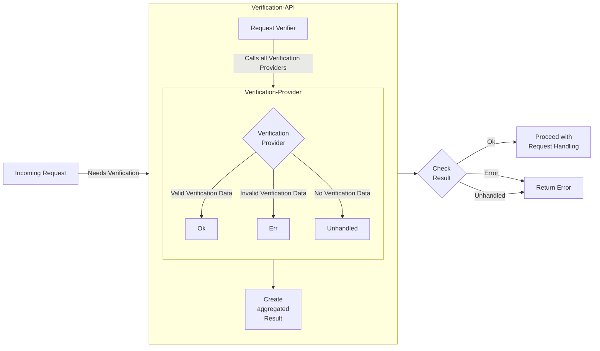

# Drupal Verification API

[](https://github.com/wunderwerkio/drupal-verification/actions/workflows/main.yml)
[](https://sonarcloud.io/summary/new_code?id=wunderwerkio_drupal-verification)

This drupal module provides the foundation to implement verification for various operations (e.g. reset password, change email or passwordless logins) that a drupal user can do.
That is done by having multiple `VerificationProvider` plugins verifying a request.

**Table of Contents:**

- [Motivation](#motivation)
- [Concept](#concept)
  - [Diagram](#diagram)
- [Example](#example)
- [Verification Providers](#verification-providers)
  - [Hash Provider](#hash-provider)
  - [Implement your own provider](#implement-your-own-provider)

## Motivation

In decoupled scenarious, some operations like updating a user email, resetting the password or cancelling a user account need additional verification as an additional security measure.

Additionally some operations must also be preceeded by a login, because the user might not be able to login (e.g. when performing a password reset).
The verification must then be able to verify the login AND the operation (e.g. the password reset).

This module tries to solve this problem by providing the foundation for a sophisticated verification system.

## Concept

The Verification API revolves around having **Plugins** that implement the `VerificationProviderBase` class. The plugins job is to verify a given request and return a `VerificationResult`.

Given that a login may preceed the actual operation, the verification is split into two parts:

1. (optional) Verify if the verification method is eligible for a login
2. Verify if the verification method is eligible for the operation

*The verification method MUST be independendtly invalidated for login and the operation!*

Therefore each plugin must implement the `verifyLogin` and `verifyOperation` methods.

> **Note**
> Each plugin is responsible to invalidate the verification method once it has been used, and to implement appropriate security measures, like prohibiting brute force attacks!

The verification is strictly tied to the following aspects:

- **Operation** - A string describing what operation should be made
- **User** - The drupal user that the operation is performed on
- **Email** - If a different email address then the user's should be used

If these change between verification start and finish, the verification MUST fail.

### Diagram



## Example

```php
<?php

use Drupal\Core\Controller\ControllerBase;
use Drupal\verification\Service\RequestVerifier;
use Symfony\Component\HttpFoundation\JsonResponse;
use Symfony\Component\HttpFoundation\Request;
use Symfony\Component\HttpFoundation\Response;

class MyController extends ControllerBase {

  public function __construct(
    // This is the 'verification.request_verifier' service.
    protected RequestVerifier $verifier,
  ) {}

  public function handleUpdatePassword(Request $request): Response {
    $user = $this->currentUser();

    $payload = $request->getContent();
    $data = Json::decode($payload);

    $mail = $data['email'];

    // Verify the operation.
    $result = $this->verifier->verifyOperation($request, 'update-password', $user, $mail);

    // Check if OK.
    if ($result->ok) {
      // The verification was successful! Yay!

      // More information MAY be found by checking the code.
      echo $result->code;
    }

    // Check if unhandled.
    if ($result->unhandled) {
      // The verification was not handled.
      // This is the case if none of the registered verification providers
      // could relevant verification data in the request.
    }

    // Check if error.
    if ($result->err) {
      // The verification was handled, but resulted in an error.

      // An error code is always set.
      // Possible error codes depend on the verification provider.
      echo $result->code;
    }

    // For convenience, the result can also generate a JSON:API schema conform
    // error message, if the result was not OK, otherwise returns NULL.
    //
    // @see https://github.com/wunderwerkio/jsonapi-error
    if ($response = $result->toErrorResponse()) {
      return $response;
    }
  }

}
```

## Verification Providers

Here is a curated list of verification providers that utilize the Verification API:

- [Hash (built-in)](#hash-provider)
- [Magic Code](https://github.com/wunderwerkio/drupal-magic-code)

*If you want your verification provider listed, feel free to open an issue.*

### Hash Provider

**Install the `verification_hash` module.**

The `Hash` provider is a built-in verification provider that uses a hash and timestamp from the `user_pass_rehash` function to verify an operation.

This provider expects the incoming Request to have the following header:

`X-Verification-Hash: <hash>$$<timestamp>`

The hash and timestamp are separated with two dollar signs.

For comparison, a new hash is generated by the provider for the given user account.
The generated hash and passed hash are then compared if they match.

In addition, the hash is only valid for the configured password
reset timeout in `user.settings.password_reset_timeout`.

### Implement your own provider

To implement a custom Verification Provider, create a new `VerificationProvider` Plugin that
is annotated with the `VerificationProvider` annotation, extends the `VerificationProviderBase` class
and implements the `VerificationProviderInterface` interface.

> **Note**
> Do not forget to invalidate data, so that a verification method cannot be re-used.

A real implementation can be found at `./modules/verification_hash/src/Plugin/VerificationProvider/Hash.php`.

**This is a crude example**

```php
<?php

declare(strict_types=1);

namespace Drupal\verification_hash\Plugin\VerificationProvider;

use Drupal\Core\Plugin\ContainerFactoryPluginInterface;
use Drupal\Core\Session\AccountInterface;
use Drupal\verification\Plugin\VerificationProviderBase;
use Symfony\Component\HttpFoundation\Request;
use Drupal\verification\Result\VerificationResult;

/**
 * Custom verification provider plugin.
 *
 * @VerificationProvider(
 *   id = "custom_provider",
 *   label = @Translation("Custom Provider"),
 * )
 */
class CustomProvider extends VerificationProviderBase implements ContainerFactoryPluginInterface {

  /**
   * {@inheritdoc}
   */
  public function verifyLogin(Request $request, string $operation, AccountInterface $user, ?string $email = NULL): VerificationResult {
    // Implement login verification here...

    if ($verification_data_not_found) {
      return VerificationResult::unhandled();
    }

    // Invalidate verification method for `login` here if it was handled.

    if ($verification_was_successful) {
      return VerificationResult::ok();
    }

    if ($verification_has_failed) {
      return VerificationResult::err('some_error_code');
    }
  }

  /**
   * {@inheritdoc}
   */
  public function verifyOperation(Request $request, string $operation, AccountInterface $user, ?string $email = NULL): VerificationResult {
    // Implement operation verification here...

    if ($verification_data_not_found) {
      return VerificationResult::unhandled();
    }

    if ($verification_was_successful) {
      return VerificationResult::ok();
    }

    if ($verification_has_failed) {
      return VerificationResult::err('some_error_code');
    }
  }

}
```
