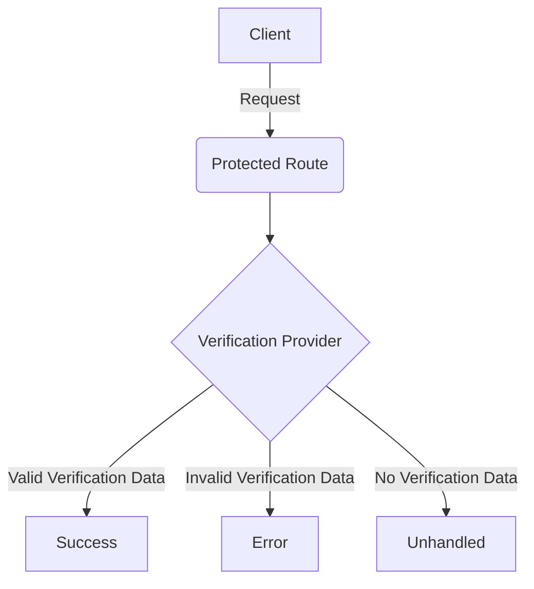

# Verification API [](https://github.com/wunderwerkio/drupal-verification/actions/workflows/main.yml)

The Verification API module provides the foundation to have multiple Verification Provider Plugins verify a given HTTP Request for a given User that a specific operation (e.g. password-reset) can be done.

**Table of Contents:**

- [Motivation](#motivation)
- [Diagram](#diagram)
- [Technical Details](#technical-details)
  - [Using a different email](#using-a-different-email)
  - [Using multiple verification providers](#using-multiple-verification-providers)
- [Built-in Verification Providers](#built-in-verification-providers)
  - [Hash Provider](#hash-provider)
- [Implementing a custom provider](#implementing-a-custom-provider)

## Motivation

In decoupled scenarios, handling verification of security-sensitive operations (e.g. email update, password reset, account cancellation) can be very tedious to implement, especially if multiple verification methods should be supported.

This module tries to solve this issue by implementing `VerificationProvider` Plugins that take a HTTP Request, a User and an operation to then verify those parameters for the given operation.

## Diagram

The following diagram shows how the Verification API works.



## Technical Details

To use verification, the `verification.request_verifier` provides a `verify` method to verify an HTTP request for a given operation or login.

It is up to the Verification Provider Plugin to make sure that the given request has the correct verification data to
verify and that the given `$user` is allowed to perform the given `$operation`.

### Using a different email

To support more complex scenarios, a different email can be passed to the `verify` method, that is differnt than the email
address that is set on the user account.

### Using multiple verification providers

When using multiple verification providers, the `verification.request_verifier` services tries all available plugins
until the first one successfully verifies the request.

## Example

```php
<?php

use Drupal\Core\Controller\ControllerBase;
use Drupal\verification\Service\RequestVerifier;
use Symfony\Component\HttpFoundation\JsonResponse;
use Symfony\Component\HttpFoundation\Request;
use Symfony\Component\HttpFoundation\Response;

class MyController extends ControllerBase {

  public function __construct(
    // This is the 'verification.request_verifier' service.
    protected RequestVerifier $verifier,
  ) {}

  public function handleUpdatePassword(Request $request): Response {
    $user = $this->currentUser();

    $payload = $request->getContent();
    $data = Json::decode($payload);

    $mail = $data['email'];

    // Verify the operation.
    $result = $this->verifier->verifyOperation($request, 'update-password', $user, $mail);

    // Check if OK.
    if ($result->ok) {
      // The verification was successful! Yay!

      // More information MAY be found by checking the code.
      echo $result->code;
    }

    // Check if unhandled.
    if ($result->unhandled) {
      // The verification was not handled.
      // This is the case if none of the registered verification providers
      // could relevant verification data in the request.
    }

    // Check if error.
    if ($result->err) {
      // The verification was handled, but resulted in an error.

      // An error code is always set.
      // Possible error codes depend on the verification provider.
      echo $result->code;
    }

    // For convenience, the result can also generate a JSON:API schema conform
    // error message, if the result was not OK, otherwise returns NULL.
    //
    // @see https://github.com/wunderwerkio/jsonapi-error
    if ($response = $result->toErrorResponse()) {
      return $response;
    }
  }

}
```

## Built-in Verification Providers

The Verification API includes built-in verification providers as submodules.

### Hash Provider

**Install the `verification_hash` module.**

The `Hash` provider is a built-in verification provider that uses a hash and timestamp from the `user_pass_rehash` function to verify an operation.

This provider expects the incoming Request to have the following header:

`X-Verification-Hash: <hash>$$<timestamp>`

The hash and timestamp are separated with two dollar signs.

For comparison, a new hash is generated by the provider for the given user account.
The generated hash and passed hash are then compared if they match.

In addition, the hash is only valid for the configured password
reset timeout in `user.settings.password_reset_timeout`.

## Implementing a custom provider

To implement a custom Verification Provider, create a new `VerificationProvider` Plugin that
is annotated with the `VerificationProvider` annotation, extends the `VerificationProviderBase` class
and implements the `VerificationProviderInterface` interface.

For an example, simply look at the source code of the `Drupal\verification\Plugin\Verification\Hash` class.
